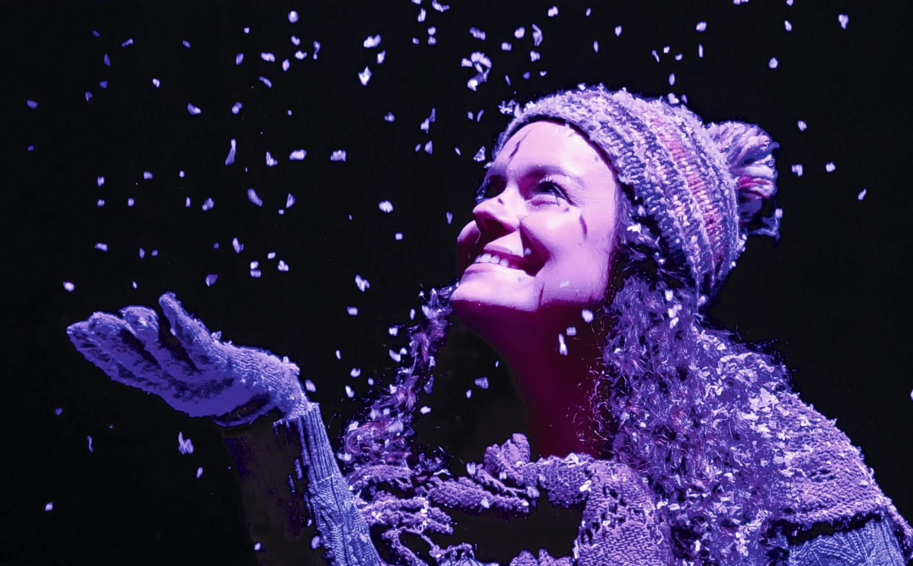
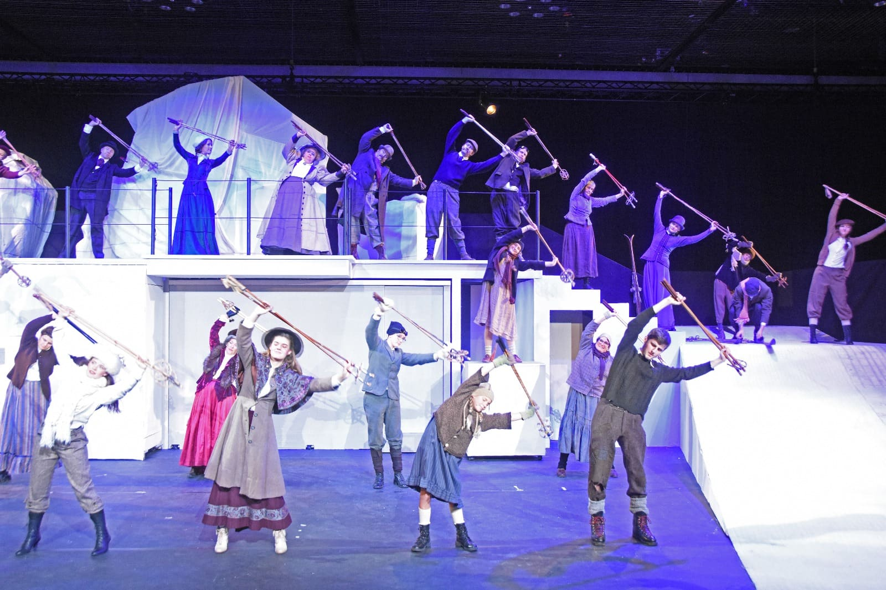
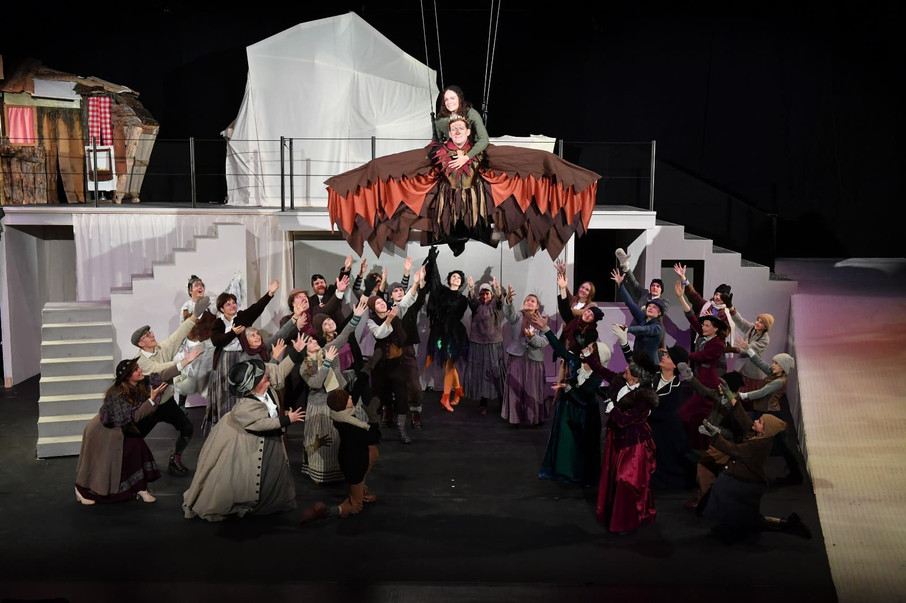

+++
title = "Wenn ein König fliegen lernt"
date = "2024-02-27"
draft = false
pinned = false
tags = ["Reportage"]
image = "5vogellisi_schneeflocken_quer-1-.jpg"
description = "Wenn die Lichter im Saal ausgehen und die Scheinwerfer an, wenn die Schauspieler zu singen und tanzen beginnen und mit ihrer Kunst die weisse Landschaft zum Leben erwecken, dann wird das ‘Vogellisi und der König der Lüfte’ doch noch auf der Bühne präsentiert. "
+++
 Wenn die Lichter im Saal ausgehen und die Scheinwerfer an, wenn die Schauspieler zu singen und tanzen beginnen und mit ihrer Kunst die weisse Landschaft zum Leben erwecken, dann wird das ‘Vogellisi und der König der Lüfte’ doch noch auf der Bühne präsentiert.
 

Anna Mürner und Erine Raedler

Wir befinden uns in einem kleinen Saal, die Tribüne ist ein Gerüst aus Holz Planken und Metall. Aneinander reihen sich Blaue Stühle, die eher klein sind, auch für eine Jugendliche, mit weichen lila Kissen, die die Stuhl Grösse entschuldigen. Der Saal ist beleuchtet, die Bühne dunkel und unberührt und es scheint, als wäre die weisse Konstruktion von Treppen, Hügeln und einer Bank neben einem einfachen Baum auf Rädern am Schlafen. Als die Lichter im Saal ausgehen kündet der Sprecher des Ski-Weltcups Adelboden ein Lauf eines Skirennens an doch bald wird er abgelöst vor einer beruhigenden Frauenstimme, die uns in die Zeit, in der das Stück spielt, einführt. Sie erzählt, wie es damals war als das Vogellisi gelebt hatte. Ein einzelner Lichtstrahl erscheint, darin steht das Vogellisi. Sie dreht sich im herabfallenden Schnee und die Show beginnt.  

### Eine Idee wird gelegt

Mich faszinieren die zwei Welten, einerseits die historische Welt, welche schon in «Vogellisi ein Naturmärchen» und auch beim grossen Traum und bei König der Lüfte eine sehr starke Rolle gespielt hat: Also die ganze Entwicklung vom Tourismus. (...) Ich habe dann zum Teil auch meinen Vater gefragt, wie es war in unserem Hotel, wie es erbaut wurde, wie es früher war, ihm musste man immer die Würmer aus der Nase ziehen, aber manchmal hat er dann ein paar Anekdoten erzählt. Auch in der Schule hatte man das Thema. Es gibt das Buch ,100 Jahre Kurort Adelboden´. Das ist ganz ein spannendes Buch, welches den Aufbau von Adelboden beschreibt. Das ist die erste grosse Faszination, das Historische, also nicht nur von Adelboden, sondern auch diese Auswandererwelle 1890, welche im ‘grossen Traum’ thematisiert wurde. Dort interessiert mich immer der Mensch, was er daraus gemacht hat, was er für eine Rolle gespielt hat, mit was er kämpfte und es ist auch sehr interessant, da es existentielle Nöte sind. Also im ‘grossen Traum’ zum Beispiel, das Heimweh und das Ausgestossen sein oder im ‘Vogellisi, ein Naturmärchen’ die Angst vor dem Tourismus. 
Der andere Aspekt ist das Märchenhafte, welches in allen 3 Stücken eine grosse Rolle spielt. (…) Das Mystische ist auch immer das, was man nicht sieht, das, was man eigentlich spürt. Deshalb habe ich das Gefühl, dass die Poesie, die Mystik immer ganz etwas Spannendes ist, weil man es im Märchen sichtbar machen kann, was man im alltäglichen Leben manchmal nicht kann. 

> « Diese wahnsinnigen Bilder, welche ich beim Schreiben kreiert hatte, sind immer wieder gekommen.» 
>
> *Annemarie Stähli, Regisseurin der Oberländer Märlibühni*

### Das Kücken ist geschlüpft

Die Schauspieler\*innen brauchen bis zu 2,5 Stunden, um ihr Kostüm anzuziehen, in die Maske zu gehen und sich in die Rolle hineinzuversetzen. Dies geschieht in einem Luftschutzbunker der Armee unter dem KKThun, welcher nur durch die Garage betretbar ist. Der Stress ist den Performer\*innen kaum anzusehen, in der Maske wird über den Energydrink Konsum der heutigen Jugend gesprochen, jüngere Darsteller*innen helfen andern mit ihren Kostümen oder sitzen etwas gelangweilt auf dem Sofa. Bilder vorheriger Veranstaltungen hängen an den sonst kahlen Wänden, auf den Tischen liegen Dankeskarten, Getränke oder angeschriebene Mikrofone.

Die Sänger\*innen müssen sich einsingen, auch ein Soundcheck muss gemacht werden, welcher eine halbe Stunde vor der Aufführung stattfindet. Annemarie kommt meistens auch in die Garderobe und plaudert mit den Schauspieler\*innen. Wenn alle anwesend sind, liest sie Kritik vor, um Motivation zu spenden und erzählt, wer heute im Publikum sitzt. Dies ist wichtig für Hubi, ein aufbrausender Charakter dessen Improvisation-Text immer dem Publikum angepasst wird. Anschliessend kommt das Wichtigste: der Schlachtruf, der bestimmte Zeilen aus dem Text aufnimmt, bevor es dann in Richtung Saal geht. Hinter der Bühne spähen manche hinter dem Vorhang hervor, um Verwandte oder Bekannte im Publikum zu entdecken, doch die meisten versetzten sich noch einmal in ihre Rolle und gehen auf ihre Plätze. Das letzte Mal wird geprüft, ob die Perücke sitzt, das Make-up stimmt und das Kostüm richtig getragen wird. Auch wichtig ist, dass keine Uhren oder nicht in die Zeit passenden Schmuck zu sehen sind. Dann geht es auch für die Schauspieler*innen endlich los.

### Wenni numä wüsst...

Ja, es war ein extremer Prozess und ich habe unglaublich mit mir gekämpft, denn wir hatten eigentlich gesagt, dass wir nicht noch einmal Vogellisi machen, schon gar nicht dieses Stück. Ich habe mich dann mit ganz vielen anderen Stücken befasst, doch konnte mich nicht auf etwas anderes einlassen. Diese wahnsinnigen Bilder, die ich beim Schreiben kreiert hatte, sind immer wieder gekommen. Ich dachte dann es wäre so wahnsinnig spannend dies umzusetzen. Die anderen Sachen wirkten langweilig auf mich, weil ich wie kein Feuer dafür hatte, dennoch sagte ich mir immer wieder nein, wir spielen nicht dieses Stück. Ich führte immer wieder Gespräche auch mit externen Leuten, die eigentlich alle sagten, nein, das würde ich nicht tun. Also bekam ich immer wieder einen Schlag. (...) Sie sagen auch, dass es besser wäre, etwas Neues zu machen, eine neue Geschichte. 

### Hochgeflogen und heil gelandet

Das Bauchgefühl. Ich sprach dann viel mit Renate (Mitgründerin der Oberländer Märlibühni) darüber. Wir sagten dann, dass es eigentlich immer gut kam, wenn wir auf unser Bauchgefühl gehört hatten. Denn mein Bauchgefühl sagte (...) dass diese Bilder gut kommen und die müssen wir auf die Bühne holen. Dies war schlussendlich auch ausschlaggebend. 



### Die Geschichte vom Vogellisi

Im Sommer 2017 und 2018 wurde das Stück ‘Vogellisi, ein Naturmärchen' als Freilichttheater aufgeführt. In diesem Stück geht es um Lisi, die ihre grosse Liebe findet. 
Im Frühling 2022 wurde ‘Der grosse Traum’ aufgeführt. Dort wanderten 4 Adelbodner nach Amerika aus und suchten dort ihr Glück. Zwei der Auswanderer sind die Eltern von Lisi und finden in Amerika zueinander. Aufgrund von Heimweh kommen sie wieder zurück. 
In der Weihnachtszeit 2023 wurde dann im KKThun das ‘Vogellisi und der König der Lüfte’ aufgeführt. Dort wird die Geschichte erzählt, wie Lisi zu ihrem Namen als Vogellisi kommt. Denn sie rettet eine kleinen, verletzten Adler, auf dem sie am Ende fliegt.

